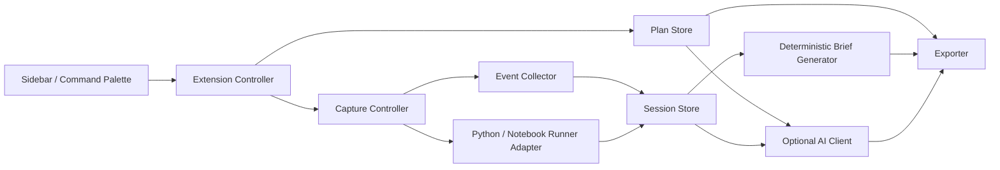

# VS Code Desktop 编程行为分析扩展设计

日期：2026-08-10

目标分支：`codex/vscode-extension`

首发版本：`0.1.0`

制品：`behavior-audit-vscode-0.1.0.vsix`

## 1. 背景与决策

现有 `myextension 0.3.0` 是 JupyterLab 4 前端扩展和 Jupyter Server Python 后端的组合，不能直接安装进 VS Code。本阶段单独开发 VS Code Desktop 版，保留已验证的产品边界、会话模型、可靠保存思路和确定性简报规则，不复制 JupyterLab UI，也不启动本地 HTTP 服务。

已确认采用纯 TypeScript VS Code 扩展方案。第一版是完全独立本地版，不依赖 BAMS、FinColab 或 Jupyter Server。它优先支持 `.py` 文件和 `.ipynb` Notebook，最终交付一个可安装的 `.vsix`。

## 2. 目标用户与问题

教师需要用题目、知识点和观察依据定义教学观察方案，并把方案交给学生。学生需要在 VS Code Desktop 中明确开始和结束采集，在 30–40 分钟课堂中持续保存客观编程行为，并在异常退出后恢复。会话结束后，扩展要生成可读、可导出、不依赖 AI 的本地简报。

第一版的“教师”与“学生”是两个功能入口，不是账号权限隔离。真正的身份、课程、班级和教师查询权限属于后续平台接入。

## 3. 业务范围

### 3.1 本期包含

- 教师新建、修改、发布、导入和导出本地题目方案。
- 可选的 ARK/OpenAI 兼容 AI 知识点与测试建议。
- 学生选择方案、阅读采集说明、确认并开始监控。
- `.py` 文件编辑、粘贴、保存、文件切换和扩展专用 Python 运行记录。
- `.ipynb` 单元格编辑与 VS Code Notebook 运行状态记录。
- 追加式本地保存、连续序号、异常退出检测和会话恢复。
- 正常、部分和明确放弃会话的确定性本地简报。
- 方案、操作日志、过程日志和课堂简报导出。
- Windows、macOS 和 Linux 上的 VS Code Desktop 安装包。

### 3.2 本期不包含

- code-server、VS Code for Web 或浏览器扩展宿主。
- Java、C++、JavaScript 等其他语言的可靠运行结果判断。
- 解析或保存普通终端中的命令、参数、输出和环境变量。
- VS Code 整个退出期间的后台采集。
- BAMS/FinColab 实时上传、教师端查询、身份映射或课程同步。
- 自动评分、排名、处分、能力诊断或知识掌握度判定。
- 在安装过程中自动下载 Python、修改系统环境或启动常驻系统进程。

## 4. 总体架构

VS Code 版位于仓库的 `vscode-extension/` 独立目录。JupyterLab 源码、Python 后端和 0.3.0 wheel 不作为 VSIX 运行依赖。



### 4.1 模块边界

| 模块 | 职责 | 不负责 |
| --- | --- | --- |
| `extension` | 激活、命令、视图、恢复入口 | 直接解析日志或调用 AI |
| `planStore` | 方案校验、版本化、导入导出 | 会话采集 |
| `captureController` | 会话状态机和采集器组合 | 自己实现文件存储 |
| `eventCollector` | 将 VS Code 事件标准化 | 解释学生意图 |
| `pythonRunner` | 扩展专用运行、退出码和有界输出 | 解析普通终端内容 |
| `sessionStore` | 追加写入、原子状态、恢复和数据隔离 | 生成教学结论 |
| `briefGenerator` | 从本地客观事件生成确定性简报 | 评分或调用外部模型 |
| `aiClient` | 可选的短建议和会话辅助分析 | 保存 API Key 明文 |
| `sidebar` | 教师/学生流程和可访问状态展示 | 直接读写磁盘 |
| `exporter` | 受控导出和完整性清单 | 自动上传到平台 |

## 5. 数据模型和会话状态

### 5.1 方案

发布后的方案包含 `plan_id`、单调 `version`、题目、知识点、观察依据、测试草稿、创建时间和内容 SHA-256。会话开始时复制完整方案快照，后续修改不会改写历史会话。导入时执行 schema 版本、字段长度、唯一 ID 和哈希校验。

### 5.2 会话

会话状态为：

```text
idle -> collecting -> finalizing -> completed
                    -> partial
                    -> abandoned
collecting -> interrupted -> collecting | partial | abandoned
```

- `collecting`：持续接收并落盘事件。
- `interrupted`：上次退出时未完成结束流程，等待用户选择续接或结束。
- `completed`：用户正常停止且本地事件完整。
- `partial`：异常退出后用已落盘数据结束。
- `abandoned`：用户明确放弃；仍保留已采集数据和最小简报。

同一个 VS Code 实例同时只允许一个 `collecting` 会话。开始新会话前必须处理旧会话。

### 5.3 事件

每个事件至少包含：

- `event_id = <session_id>:<session_seq>`
- `session_id` 和从 1 开始的连续 `session_seq`
- UTC 时间戳和单调计时值
- 事件类型
- 工作区相对 URI 或经脱敏的文档标识
- 文档语言、Notebook 单元标识等有界上下文
- 受约束的编辑摘要、运行退出码、耗时或截断后输出

普通终端只可记录“外部终端活动发生”这一事实，不保存命令、参数、输出或环境变量，也不用它判断运行成功与否。

## 6. 持久化与长时监控

数据保存在 VS Code 为扩展分配的 `ExtensionContext.globalStorageUri`，不写入当前 Git 工作区。存储按工作区和会话隔离，目录名只使用稳定 ID，不直接暴露绝对路径。

```text
globalStorageUri/
  plans/
  workspaces/<workspace_hash>/sessions/<session_id>/
    plan_snapshot.json
    session_state.json
    events.jsonl
    operation_log.json
    process_log.md
    classroom_brief.json
    ai_analysis.json          # 仅在可用时存在
```

落盘策略：

- 事件先进入有界内存队列，最多累积 20 条或 1 秒就按序追加到 `events.jsonl`。
- 写入任务串行化，不允许后一批越过前一批。
- `session_state.json` 先写同目录临时文件，再原子替换。
- 每次状态转换、每 5 秒心跳和扩展 `deactivate` 时刷新检查点。
- 本地写入失败后立即停止接受新证据，显示稳定错误码，不把内存数据伪装成已保存。
- 源码快照、错误文本和运行输出都有单项与会话级上限；截断后写入明确标志。

VS Code 窗口打开时，即使侧边栏关闭或失去焦点，扩展主机仍持续处理可用的 VS Code 事件。整个 VS Code 退出后不再产生新记录；下次打开只能恢复退出前已落盘的数据。本期不通过常驻后台进程绕过该边界。

## 7. Python 与 Notebook 运行证据

### 7.1 Python 文件

只有扩展命令“运行当前 Python 文件并记录”产生可判定的运行证据。扩展先请求保存当前文档，然后优先使用 Microsoft Python 扩展已选择的解释器。找不到解释器时显示选择指引，不自动安装 Python。

子进程使用参数数组和 `shell: false`，记录开始/结束时间、退出码、耗时及有界标准输出/错误输出。不执行用户提供的 shell 字符串。

### 7.2 Notebook

扩展监听 VS Code Notebook 单元格文档变化和可用的单元格执行状态，记录单元标识、开始/结束、成功/失败、耗时和有界输出摘要。如果当前 VS Code/API 组合无法提供可靠结束状态，则仅记录“执行请求/状态未知”，不推断成功。

## 8. 确定性课堂简报

简报由本地纯函数根据方案快照、终态和已落盘事件生成，不依赖 AI。固定包含：

1. 会话结果：`completed`、`partial` 或 `abandoned`。
2. 有效观察时长及其统计口径。
3. 运行统计：总次数、成功、失败、未知。
4. 行为证据摘要：仅陈述已采集的客观时序。
5. 可选关注点：仅在规则有足够证据时出现，不生成评分或掌握度。

同一份输入必须生成字节等价的规范化 JSON 简报（除了明确存储的生成时间字段），以便测试、校验和后续平台对接。

## 9. 可选 AI 能力

核心方案创建、采集、恢复、结束、简报和导出不依赖 AI。AI 只用于：

- 教师明确点击后生成知识点与测试建议。
- 会话结束后，用户明确启动的辅助分析。

Base URL 和模型作为普通 VS Code 设置，API Key 只保存在 `ExtensionContext.secrets`。Base URL 必须使用 HTTPS；只有 `127.0.0.1` 或 `localhost` 允许 HTTP。请求前对本机绝对路径脱敏，把学生代码、注释和错误文本视为不可信数据，并仅发送当前任务必需的有界片段和证据摘要。

AI 错误不影响本地数据结束。超时、网络、鉴权、限流、Provider 5xx、响应截断和结构错误使用稳定错误码，保留当前草稿或本地简报，允许重试或手工继续。

## 10. 界面与操作流程

Activity Bar 提供“编程行为分析”入口。侧边栏是有语义、可键盘操作的 Webview View，同时为所有主要操作注册 Command Palette 命令。监控状态还会显示在 Status Bar，不依赖侧边栏保持展开。

### 10.1 教师入口

1. 新建或导入题目方案。
2. 填写题目、知识点和观察依据。
3. 可选调用 AI 获取建议。
4. 采用、修改、删除或完全手工编辑。
5. 确认并发布不可变本地版本。
6. 导出方案 JSON。

### 10.2 学生入口

1. 导入或选择方案。
2. 阅读采集范围并勾选确认。
3. 开始监控；Status Bar 显示时长、事件数和最近落盘时间。
4. 编辑 Python/Notebook，通过受支持入口运行。
5. 正常结束，或重启后续接/结束 partial 会话。
6. 查看会话结果、有效观察时长、运行统计、行为证据摘要和可选关注点。
7. 一键导出本次日志和简报目录。

启用 AI、停止会话、结束为 partial、放弃会话和清理本地数据都需要明确确认。界面始终说明教师/学生入口不是权限隔离。

## 11. 信任、隐私与安全

- 扩展对 VS Code 未受信工作区声明 limited 支持：可查看方案和历史简报，但不能开始监控、运行代码或调用 AI。
- API Key 不出现在 `settings.json`、工作区、日志、导出包、错误信息或遥测中。
- 不记录系统其他应用、键盘全局输入、剪贴板原文或普通终端内容。
- 导出前显示目标目录和包含的文件；扩展不自动上传、发送或共享。
- 清理操作必须显示精确会话或工作区范围，默认不递归删除整个扩展数据根目录。
- 所有教学观察文案避免心理、人格、能力或知识掌握断言。

## 12. 错误模型

可恢复错误必须有稳定代码、简体中文解释和单一建议动作。首期错误类别包含：

- `storage_unavailable`、`storage_write_failed`、`storage_corrupt`
- `session_conflict`、`session_recovery_required`、`session_sequence_invalid`
- `workspace_untrusted`、`python_interpreter_missing`、`python_run_failed`
- `ai_not_configured`、`ai_provider_timeout`、`ai_provider_network_error`
- `ai_provider_auth_failed`、`ai_provider_rate_limited`、`ai_provider_unavailable`
- `ai_response_truncated`、`ai_response_invalid`
- `export_failed`、`import_invalid`、`unsupported_schema_version`

本地写入错误属于采集阻断错误；AI 和导出错误不得改写已完成的本地会话。损坏文件保留原件并生成诊断副本，不自动删除。

## 13. 测试策略

### 13.1 单元和契约测试

- 方案校验、标准 JSON 和内容哈希。
- 事件标准化、连续序号、上限和截断。
- 会话状态机、恢复、partial 和 abandoned 路径。
- 简报的确定性、五个固定类别和无评分边界。
- AI 请求脱敏、稳定错误码和手工降级。
- 导入/导出 schema 和版本兼容。

### 13.2 存储与恢复测试

在临时目录使用真实 Node 文件 API 测试串行追加、原子替换、中途失败、损坏 JSONL 尾部、多工作区隔离、重启恢复和数据清理范围。

### 13.3 VS Code Extension Host 测试

使用官方 VS Code 测试宿主验证：激活、命令注册、视图消息契约、状态栏、文档编辑事件、Python 专用运行、Notebook 事件和重启恢复。

### 13.4 长时与制品验证

- 用可控时钟加速模拟 40 分钟事件流，验证内存有界、序号连续和简报统计。
- 在真实 VS Code Desktop 执行一次 40 分钟持续运行验收，期间包含编辑、保存、成功/失败运行和一次窗口重启。
- 在 Windows、macOS 和 Linux 的自动化环境执行编译、Lint、单元测试和 VSIX 解包检查；真实桌面验收至少覆盖当前交付主机。
- 制品扫描不得出现 API Key、真实会话、本机绝对路径或未申明的大型依赖。

自动测试不调用真实或付费 AI。

## 14. 交付目录与安装

源码目录：

```text
vscode-extension/
  package.json
  src/
  media/
  schemas/
  test/
```

最终交付目录：

```text
deploy/vscode/release-0.1.0/
  behavior-audit-vscode-0.1.0.vsix
  SHA256SUMS
  README.md
  INSTALL.md
  demo/
```

`INSTALL.md` 要求只使用 VS Code 标准安装方式：图形界面“Install from VSIX”或 `code --install-extension <file.vsix>`。安装文档要说明 Python 扩展/解释器前置、工作区信任、AI 可选配置、数据位置、导出、卸载和回滚。

## 15. 兼容性、迁移与回滚

- VS Code 版使用独立扩展 ID 和存储根，不读写 JupyterLab 插件的运行目录。
- 方案导出 schema 保留明确 `schema_version`，未来可编写显式转换器，不依赖隐式字段推断。
- 0.1.x 升级只允许向后兼容的附加字段；破坏性数据变更必须升 schema 主版本并提供备份/转换。
- 回滚为卸载新 VSIX 并重新安装保留的旧 VSIX。软件回滚不自动删除会话数据。
- 任何数据迁移、批量删除或平台上传都是独立授权阶段。

## 16. 后续平台接入点

本期不实现同步，但内部保留 `SessionSink` 概念边界：本地存储是唯一默认实现，采集器不直接依赖 BAMS/FinColab URL。平台接入必须单独设计和验收：

- 统一的学生、教师、课程、班级和任务 ID。
- 受鉴权的会话创建、分段回执、结束和教师查询契约。
- 离线队列、幂等、连续序号、冲突处理和保留策略。
- 教师端简报传输、访问控制、操作审计和数据删除流程。

只有平台契约和后端代码可用时才实现该适配器，不在 VS Code 扩展中猜测字段。

## 17. 验收标准和停止点

0.1.0 只有同时满足以下条件才能交付：

1. 新用户只根据 `INSTALL.md` 即可安装 VSIX，扩展激活无错误。
2. 可创建、发布、导出和重新导入一份合成题目方案。
3. 可开始会话，采集 `.py` 编辑和扩展专用运行，生成连续序号日志。
4. 可采集 Notebook 编辑和当前 VS Code API 能可靠提供的执行状态。
5. 异常退出后能续接，或使用已落盘事件生成 partial 简报。
6. 正常结束和 partial 结束都生成五个固定简报类别和完整导出文件。
7. 未配置或调用失败的 AI 不影响上述任何本地流程。
8. 自动测试、三平台构建、VSIX 解包检查、哈希校验和真实 40 分钟验收都有可核实记录。
9. 交付包不包含密钥、真实学生数据、本机绝对路径或未声明后台服务。

本阶段的停止点是本地生成并验证 `deploy/vscode/release-0.1.0/` 交付目录。不发布到 VS Code Marketplace，不部署 BAMS/FinColab，不调用真实付费 AI，也不自动合并到 GitHub `main`。
