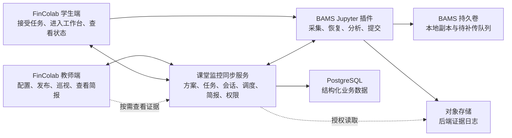
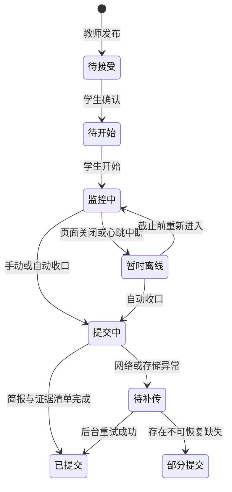

# 教师发布、学生监控与课堂简报平台设计

**日期：** 2026-08-12
**状态：** 已确认，待制定实施计划
**适用范围：** FinColab 教师端与学生端、BAMS Jupyter 工作台、编程行为监控分析插件、拟新增课堂监控同步服务

## 1. 背景与目标

当前系统已经具备以下基础：

- FinColab 前端已有教师、学生和管理员角色，以及教师实验与学生子工作台关系；
- 学生可以通过 BAMS 的 `40037` HTTPS 入口打开 Jupyter 工作台；
- Jupyter 插件已有方案、采集会话、日志、分析和课堂简报能力；
- 同仓库 VS Code 插件已经实现教师创建方案、学生执行任务的角色流程，可复用其产品思路。

当前问题是这些能力仍以单个工作台为中心：学生端仍可看到创建方案能力，教师端没有发布方案和查看全班结果的入口，学生容器之间也没有可信的共享数据通道。

本设计目标是形成真实课堂可用的闭环：

1. 教师为一个实验配置并发布不可变方案版本；
2. 平台将方案自动下发给该实验下的全部学生子工作台；
3. 学生知情确认后开始监控，不能创建或修改教师方案；
4. 页面误关、断网或服务重启后可恢复同一会话；
5. 学生可在下课时手动提交，未提交者在实际下课后 15 分钟自动收口；
6. 每名学生最终只形成一份便于教师阅读的结构化简报；
7. 详细日志转存到后端证据存储，教师需要时从简报按需查看；
8. 教师能快速判断学生掌握了什么、哪里存在问题以及是否需要复核。

## 2. 本阶段边界

### 2.1 本设计包含

- 角色和产品流程；
- 系统组件和数据流；
- 方案、任务、会话、简报和证据契约；
- 页面信息架构；
- 共享服务接口边界；
- 页面误关、断网和自动提交策略；
- 权限、安全、持久化和可观测性；
- 分阶段实施、验收、部署和回滚原则。

### 2.2 本设计不包含

- 当前演示网页的任何修改；
- 当前前端、插件、镜像或线上环境的部署；
- BAMS 原后端内部重构；
- 自动评分或替代教师做最终教学判断；
- 证明学生必然使用或未使用外部 AI 工具。

设计确认后的停止点是编写文件级实施计划，不直接进入实现或部署。

## 3. 已确认的产品决策

1. 新增独立的课堂监控同步服务，未来可并入 FinColab 后端；
2. 方案绑定教师实验，并自动下发给全部学生子工作台；
3. Jupyter 插件现有 Profile v2 是统一执行格式，VS Code 流程只作为教师端交互参考；
4. 学生不能创建、编辑、发布方案，也不能配置教师 AI 密钥；
5. 教师发布时设置计划上下课时间，并可点击提前下课；
6. 学生可以手动提交，未提交者在实际下课后 15 分钟自动收口；
7. 页面关闭不等于提交，重新进入应恢复原会话；
8. 学生最终只提交一份结构化简报；
9. 日志增量上传并长期保存在后端证据存储，教师按需查看；
10. AI 只增强解释，失败不能阻塞基础简报和提交。

## 4. 方案比较与选择

### 4.1 方案 A：独立课堂监控同步服务（采用）

在现有 FinColab 前端、BAMS 和插件之外新增共享服务，统一负责方案版本、任务绑定、会话状态、自动提交、简报和证据索引。

优点：

- 不要求立即取得或大改原平台后端；
- 能跨学生容器建立可信共享通道；
- 功能可通过开关逐步启用，容易回滚；
- 将来并入 FinColab 后端时可以保持现有接口契约。

### 4.2 方案 B：直接改造 FinColab 后端

长期架构更统一，但必须取得后端仓库、认证模型和数据库迁移能力。当前协调成本和发布风险更高，作为后续收编方向而非第一版前置条件。

### 4.3 方案 C：学生直接上传三份日志文件

实现简单，但无法可靠完成全班实时状态、自动收口、权限控制、误关恢复和统一教学视图，只适用于临时演示，不作为真实课堂方案。

## 5. 总体架构



### 5.1 教师端

- 在现有实验管理中配置和发布考核方案；
- 查看全班实时状态和课后简报；
- 提前结束课堂、标记关注、填写评语和复核结论；
- 需要时从简报下钻查看证据，不手工管理三个日志文件。

### 5.2 学生端

- 展示教师下发的任务、监控范围、AI 规则和时间；
- 学生知情确认后签发工作台票据；
- 展示开始、恢复、同步和提交状态；
- 不包含任何方案创作、发布或教师配置能力。

### 5.3 课堂监控同步服务

- 可信身份和课程成员权限校验；
- 方案草稿、不可变版本和实验绑定；
- 学生任务幂等同步；
- 一次性票据和短期会话令牌；
- 会话心跳、摘要、证据索引和简报；
- 实际下课后 15 分钟的持久化自动收口；
- 教师巡视、班级汇总和审计。

### 5.4 Jupyter 插件

- 读取并校验固定方案版本；
- 采集、排序和持久化行为事件；
- 页面误关后恢复原会话；
- 增量上传证据，维护待补传发件箱；
- 生成确定性基础简报，再选择性补充 AI 分析；
- 响应手动提交和自动收口请求。

## 6. 角色与课堂主流程

### 6.1 教师发布

教师在现有实验中使用三步向导：

1. 输入题目；
2. 确认知识点、观察问题、支持表现和排除情况；
3. 设置上下课时间与 AI 规则，预览并发布。

发布后：

- 系统生成不可变方案版本；
- 自动为实验下全部学生子工作台创建任务；
- 后加入课程的学生自动补建任务；
- 未开始学生可切换到教师后续发布的新版本；
- 已开始学生固定使用开始时的版本。

### 6.2 学生接受和开始

学生首次进入前看到题目、知识点、采集范围、时间、AI 规则、教师查看范围和自动提交规则。点击“接受并开始”后：

1. 学生端申请一次性票据；
2. 经 `https://14.103.139.131:40037` 打开工作台；
3. 票据放在 URL fragment，插件读取后立即清除；
4. 插件以票据换取只允许写当前会话的短期令牌；
5. 插件拉取固定方案版本并创建或恢复唯一活动会话；
6. 开始采集和增量上传。

### 6.3 手动提交

学生点击“结束并提交”后：

1. 停止接收新的有效操作；
2. 发送浏览器端剩余队列；
3. 校验证据序号、哈希和缺失区间；
4. 固化证据清单；
5. 生成确定性基础简报；
6. 可选 AI 分析完成后补充解释；
7. 保存单份结构化简报和后端证据索引；
8. 返回提交结果和证据完整度。

### 6.4 自动提交

自动提交时间为：

```text
实际下课时间 + 15 分钟
```

实际下课时间取计划下课时间与教师提前下课时间中较早者。

自动提交不能依赖浏览器计时器，采用两层兜底：

- 插件服务端在线时按截止时间固化日志、生成简报并提交；
- 插件不可用时，同步服务看门狗根据已收到证据生成部分提交。

插件后续恢复时只能补传截止时间前已持久化的证据。简报可以增加修订版本和完整度，但不能把截止时间后的行为计入本次课堂。

## 7. 会话状态机与恢复



页面关闭不调用结束接口。会话由以下稳定组合唯一标识：

```text
课程 + 教师实验 + 学生 + 学生子工作台 + 方案版本
```

只要尚未超过证据截止时间，学生重新进入同一实验就恢复原会话，不创建重复会话。恢复内容包括：

- 会话标识和固定方案版本；
- 下一个事件序号；
- 浏览器 IndexedDB 中未上传事件；
- Jupyter 服务端已持久化证据和待补传队列；
- 最后同步时间和当前完整度。

超过截止时间后只允许查看和补传截止前证据，不允许继续采集本次课堂的新行为。

## 8. 核心数据模型

平台新增对象与原课程、实验和工作台对象独立关联，避免破坏原业务字段。

| 对象 | 责任 |
| --- | --- |
| `PlanDraft` | 教师编辑中的题目、知识点和规则 |
| `PlanVersion` | 发布后不可变的 Profile v2 执行快照 |
| `ExperimentPlanBinding` | 教师实验与当前方案版本的绑定 |
| `StudentAssignment` | 学生子工作台收到的任务 |
| `MonitorSession` | 学生接受、监控、离线、恢复和提交状态 |
| `EvidenceBundle` | 分块证据、哈希、序号、完整度和对象存储索引 |
| `StudentBrief` | 单份结构化学生简报及修订版本 |
| `TeacherReview` | 教师确认、修改、评语和面谈标记 |

### 8.1 方案版本

至少包含：

- 题目名称、完整题目和提交约束；
- 知识点名称、说明和观察依据；
- 支持表现和排除情况；
- 测试或运行要求；
- AI 使用规则；
- 计划上下课时间；
- 版本号、发布者、发布时间和内容哈希。

### 8.2 会话关键字段

- `submission_reason`：学生手动、教师提前结束或系统自动；
- `evidence_cutoff_at`：允许计入证据的截止时间；
- `submitted_at`：实际提交时间；
- `completeness`：完整或部分；
- `missing_ranges`：缺失事件区间；
- `brief_revision`：补传后的简报修订号；
- `plan_version`：本次执行版本；
- `last_activity_at`：最后有效操作时间。

## 9. 单份教师简报

学生最终只提交一份结构化简报。三类日志仅作为后台逻辑证据：

- 操作事件；
- 代码修改与运行过程；
- 分析输入、输出与来源。

### 9.1 顶部摘要

- 学生、课程、实验和方案版本；
- 手动或自动提交；
- 监控时长和数据完整度；
- 总体结论；
- 是否建议教师复核。

### 9.2 知识点矩阵

每个知识点使用四态结论：

- `已掌握`：存在足够且一致的代码、运行或修改证据；
- `部分掌握`：完成部分要求，但仍有明确缺陷；
- `尚未证明`：证据不足，不能直接认定学生不会；
- `需要复核`：证据矛盾、异常或疑似非正常完成。

每项结论必须说明：学生做到了什么、证据是什么、仍缺什么、建议教师看什么或追问什么。

### 9.3 过程概览与主要问题

简报展示：

- 主要工作阶段；
- 运行成功、失败和有效修改情况；
- 页面关闭及恢复情况；
- 缺失日志或异常提交；
- 最有教学价值的最多三项问题。

### 9.4 教师操作

- 确认简报；
- 修改知识点结论并填写理由；
- 添加评语；
- 标记需要面谈；
- 查看关联证据；
- 导出或打印简报。

教师修改必须保留修改前后内容和审计记录。AI 结论不能自动成为最终评分。

## 10. 证据上传与后端保存

日志不能等到最后才上传。插件采用本地优先、增量分块、后台补传：

1. 浏览器事件先写入 IndexedDB；
2. Jupyter 服务端按事件数或时间生成不可变证据块；
3. BAMS 持久卷保存本地副本和待补传发件箱；
4. 对象存储保存压缩日志正文；
5. PostgreSQL 保存证据索引、序号、哈希、时间范围和完整度；
6. 服务端以会话、序号和内容哈希幂等去重；
7. 提交时固化证据清单并生成简报。

教师默认只读取简报和证据目录。明确展开某项证据时，服务端完成权限检查并签发短期读取地址。对象存储保持私有。

学生显示“提交成功”至少要求简报和证据清单已经保存。证据仍在补传时显示“简报已提交，证据补传中”，不阻塞学生离开；补传后递增简报修订号和完整度，但不改变原提交时间。

## 11. 前端信息架构

本节描述未来入口，不授权当前阶段修改演示网页。

### 11.1 教师端

在现有实验管理中增加“考核方案”入口，并新增：

- `课堂监控`：全班状态、最后活动、关注项、提前下课；
- `学生简报`：班级知识点分布、单人简报、教师复核和证据下钻。

课堂监控主表只展示学生、状态、最后活动、掌握进度、提交情况和操作。实时更新优先使用 SSE，失败时降级为 10 秒轮询。

### 11.2 学生端

现有课程项目页展示方案和会话状态：

- 教师尚未发布；
- 待接受；
- 可开始；
- 监控中；
- 已恢复；
- 已提交；
- 证据补传中。

Jupyter 学生模式只展示任务、监控状态、最后同步、恢复提示、结束并提交和提交结果。

## 12. 服务接口边界

### 12.1 方案管理

```text
POST /v1/plan-drafts
PUT  /v1/plan-drafts/{id}
POST /v1/plan-drafts/{id}/publish
GET  /v1/experiments/{id}/plan
GET  /v1/plan-versions/{id}
```

### 12.2 任务下发

```text
POST /v1/experiments/{id}/assignments/sync
GET  /v1/student/assignments
GET  /v1/student/assignments/{id}
POST /v1/student/assignments/{id}/accept
```

### 12.3 工作台认证与会话

```text
POST /v1/student/assignments/{id}/ticket
POST /v1/monitor-sessions/register
POST /v1/monitor-sessions/{id}/resume
PUT  /v1/monitor-sessions/{id}/heartbeat
```

### 12.4 证据与提交

```text
PUT  /v1/monitor-sessions/{id}/evidence-chunks/{sequence}
POST /v1/monitor-sessions/{id}/submit
GET  /v1/monitor-sessions/{id}/submission-status
```

手动与自动提交必须调用同一个幂等收口服务，只改变 `submission_reason`。

### 12.5 教师巡视与简报

```text
GET  /v1/classrooms/{id}/monitoring
GET  /v1/classrooms/{id}/events
POST /v1/classrooms/{id}/end-early
GET  /v1/classrooms/{id}/briefs
GET  /v1/monitor-sessions/{id}/brief
GET  /v1/monitor-sessions/{id}/evidence
POST /v1/monitor-sessions/{id}/teacher-review
```

## 13. 认证、权限与审计

同步服务不能信任浏览器传入的用户名或 `role=teacher`。服务端必须验证：

- 当前用户的可信身份；
- 教师是否拥有课程和实验；
- 学生是否属于该课程；
- 学生子工作台是否属于该实验；
- 会话是否绑定当前学生和方案版本。

一次性工作台票据必须：

- 短期有效且只能使用一次；
- 绑定学生、实验、工作台和方案版本；
- 数据库只保存票据哈希；
- 换取的令牌只能写入当前学生的当前会话。

以下操作进入审计日志：方案发布、提前下课、自动提交、教师修改结论、查看详细证据和权限拒绝。日志不得记录明文票据、令牌、API 密钥或完整学生代码。

学生开始前必须看到采集范围、用途、教师查看范围和数据保留政策。

## 14. 异常和降级

| 场景 | 系统行为 | 教师视图 |
| --- | --- | --- |
| 学生误关页面 | 保留原会话，重新进入自动恢复 | 暂时离线后恢复监控中 |
| 浏览器断网 | IndexedDB 保存，恢复后按序补传 | 显示最后同步时间 |
| 插件服务重启 | 从持久卷恢复会话和发件箱 | 短暂离线 |
| 同步服务不可用 | 本地保存并指数退避重试 | 等待同步 |
| AI 失败 | 先提交确定性基础简报 | 简报可用，标明增强未完成 |
| 截止时容器不可用 | 根据已收到证据生成部分简报 | 部分提交和缺失原因 |
| 重复提交 | 返回同一提交结果 | 不生成重复简报 |
| 证据序号缺失 | 尝试补传，否则记录缺失范围 | 数据不完整，建议复核 |
| SSE 不可用 | 教师端退化为轮询 | 状态仍可更新 |

## 15. 持久化、调度和可观测性

### 15.1 持久化

- PostgreSQL：方案、任务、会话、简报、复核和证据索引；
- 对象存储：压缩后的证据正文，第一版可使用兼容 S3 的 MinIO；
- BAMS 持久卷：上传前副本和待补传队列，仅作为恢复缓冲区。

数据保留时间必须配置化，由学校在正式上线前确认。简报和复核记录随课程归档，原始证据按课程政策到期清理。

### 15.2 持久化调度

自动提交任务保存到数据库。服务重启后根据未完成会话和截止时间重建任务，不能因进程重启漏掉收口。

### 15.3 可观测性

至少监控：

- 活动课堂和会话数；
- 心跳延迟；
- 证据上传成功率、缺失区间和积压量；
- 自动提交是否准时；
- 完整、部分和失败提交数；
- AI 分析耗时和失败率；
- 持久卷和对象存储错误；
- SSE 连接和轮询降级。

请求日志统一携带 `request_id`、`classroom_id`、`assignment_id` 和 `monitor_session_id`。

## 16. 分阶段实施

### 阶段 0：冻结契约与基线

- 固化 Profile v2、任务、会话、证据块和简报 JSON Schema；
- 确认教师实验与学生子工作台映射；
- 确认可信身份和课程成员查询方式；
- 验证 BAMS 持久卷、容器出网和 `40037` 入口；
- 建立统一的构建、测试和契约验证命令；
- 定义功能开关和回滚路径。

验收：接口 Mock 能完整走通课堂状态机，跨端契约测试通过。

### 阶段 1：共享服务最小闭环

- 建立同步服务、PostgreSQL 和对象存储适配层；
- 实现方案草稿、发布、版本和实验绑定；
- 实现学生任务幂等同步；
- 实现上下课时间、提前下课和持久化调度；
- 建立服务端权限和审计基础。

验收：教师发布后，实验下全部学生获得唯一任务，版本切换符合未开始与已开始规则。

### 阶段 2：学生监控与可靠恢复

- 实现一次性票据和 `40037` 工作台上下文传递；
- 插件增加服务端强制的学生模式；
- 禁用学生方案和教师 AI 配置接口；
- 实现 IndexedDB 队列、服务端恢复和持久发件箱；
- 实现心跳、摘要和分块证据上传。

验收：学生无法调用教师接口，误关恢复同一会话，断网不丢已持久化事件，重复上传不重复入库。

### 阶段 3：单份简报与提交闭环

- 统一手动和自动提交；
- 实现实际下课后 15 分钟自动收口；
- 生成规则优先的结构化简报；
- 将证据转存后端对象存储；
- 实现知识点矩阵、主要问题和证据引用；
- 实现部分提交和补传后的简报修订。

验收：每名学生只产生一份简报；页面关闭仍能自动收口；AI 失败不影响提交；容器释放后简报和已上传证据仍可查看。

### 阶段 4：教师巡视与课后分析

- 增加课堂监控和学生简报入口；
- 实现 SSE 与轮询降级；
- 实现班级知识点掌握分布；
- 实现教师复核、评语、面谈标记和证据下钻；
- 支持导出和打印。

验收：教师重开页面能恢复全班状态，只能查看自己的课程，并能快速定位问题学生和问题知识点。

### 阶段 5：联调、盲审与生产加固

- 单元测试状态机、时间、权限和判定规则；
- 契约测试跨端 JSON Schema；
- 集成测试数据库、对象存储和调度；
- 浏览器测试教师发布、学生恢复和提交；
- 故障测试断网、关页、服务重启和容器销毁；
- 权限测试跨课程、跨学生和伪造角色；
- 真实班级规模的心跳、上传和同时提交压测；
- 由未参与开发者按页面提示完成盲审课堂流程。

## 17. 总体验收门槛

- 连续采集 45 分钟不中断；
- 页面误关后恢复原会话；
- 下课后 15 分钟内所有会话进入终态；
- 自动提交不因服务重启丢失；
- 证据分块可以幂等重试并识别缺失；
- 学生不能创建或发布方案；
- 教师跨课程访问被拒绝；
- AI 故障不影响基础简报；
- 容器释放后简报仍可查看；
- 教师能从单份简报判断掌握情况、问题和证据；
- 原实验创建、环境启动和 `40037` 工作台入口无回归。

## 18. 部署顺序与回滚

部署顺序：

1. PostgreSQL 与对象存储；
2. 同步服务，功能开关默认关闭；
3. 新版 Jupyter 插件镜像；
4. FinColab 教师端与学生端；
5. 对测试课程开启；
6. 小班试运行；
7. 全量启用。

回滚原则：

- 先关闭新入口和任务签发；
- 保留同步服务和数据，以只读方式查看既有简报；
- 前端回退不删除数据库数据；
- BAMS 回退旧镜像后仍可使用普通 Notebook；
- 不执行破坏性数据库降级；
- 已发布方案和已提交简报保持可审计。

## 19. 进入实施计划前的外部依赖

实施前需要平台团队提供或确认：

1. 可部署独立同步服务，或提供未来并入 FinColab 后端的接口约束；
2. 可信用户身份、课程成员和教师实验归属查询方式；
3. 教师实验与学生子工作台的稳定标识映射；
4. BAMS 持久卷目录与容器访问同步服务、对象存储的网络策略；
5. PostgreSQL 和对象存储运行环境；
6. 学生知情提示、证据保留期限和教师查看详细代码的校方政策。

这些条件未确认时，可以完成契约、共享服务本地实现和插件可靠性测试，但不能宣称已经达到正式课堂上线标准。

## 20. 下一步与停止点

本设计确认后，下一阶段只编写文件级实施计划。计划必须把同步服务、Jupyter 插件、FinColab 教师端、FinColab 学生端、BAMS 运维和联调测试拆成独立工作包，并为每项列出：

- 修改仓库和文件范围；
- 前置依赖；
- 测试先行步骤；
- 验证命令与验收结果；
- 部署顺序和回滚方式；
- 当前阻塞项和需要的平台接口。

在用户再次明确授权实施前，不修改演示网页、不构建发布镜像、不部署线上环境。
